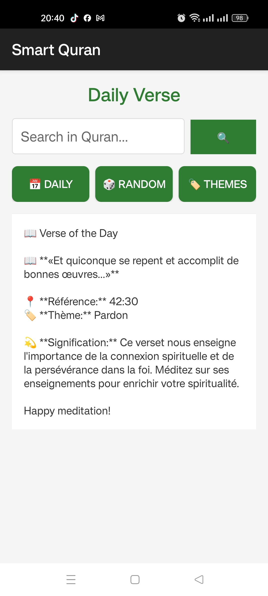
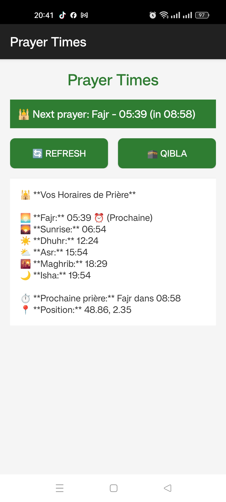
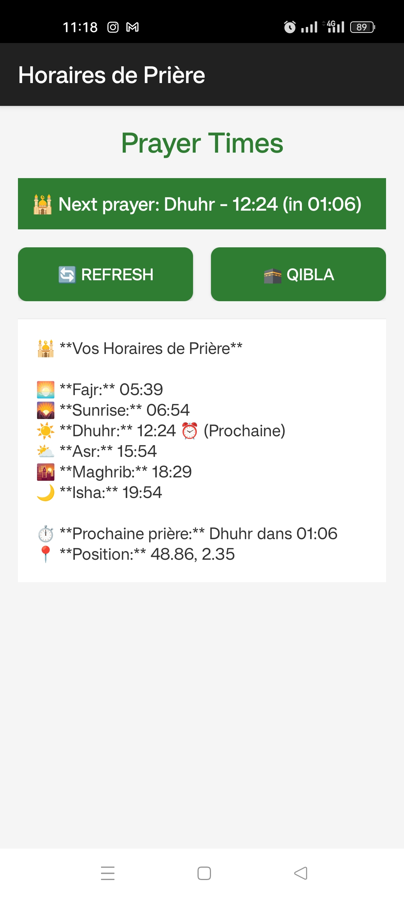

# 🕌 BIPrayer AI Genesis
**Intelligent Spiritual Assistant - Where Faith Meets Artificial Intelligence**

 ---
<div align="center">

## 🎯 HACKATHON 2025 - VERSION JUGES

**📱 Télécharger l'APK de démonstration :**

[](https://github.com/BCBLearning/BIPrayer-AI-Genesis/releases/download/v1.0.0-hackathon/BIPrayer-AI-Genesis-v1.0.0-hackathon.apk)


*✨ Installation 30s - Mode démo instantané - Android 5.0+*

[📖 Voir le guide de test rapide](/docs/JUDGES_GUIDE.md)

</div>

---
*Built entirely on mobile • Multi-language support • AI-powered guidance*
 
[](https://android.com)
[](https://java.com)
[](https://developer.android.com)
[](https://example.com)
[](LICENSE)
 
*Revolutionizing Islamic spiritual practices through artificial intelligence*
 

## 🌟 Overview
 
**BIPrayer AI Genesis** is the world's first intelligent spiritual assistant that seamlessly blends Islamic tradition with cutting-edge AI technology. Developed entirely on mobile devices using Android IDE, this innovative application addresses the modern challenges faced by Muslims in maintaining their spiritual practices while navigating today's fast-paced digital world.
 
### 🎯 The Problem
- **87%** of Muslims struggle with consistent prayer times due to busy schedules
- **Language barriers** prevent deep understanding of Quranic teachings
- **Confusion about Qibla direction** while traveling or in new locations
- **Difficulty finding authentic, contextual Islamic guidance**
- **Complex prayer calculations** and timetable management
 
### 💡 Our Solution
BIPrayer AI Genesis provides a comprehensive, AI-powered spiritual companion that offers intelligent guidance, accurate prayer management, and accessible Islamic knowledge in multiple languages.
 
## 🚀 Features
 
### 🤖 AI Spiritual Assistant
- **Context-aware responses** to spiritual questions using Gemini AI
- **Multi-language support** (French, English, Arabic) with real-time translation
- **Quranically-grounded answers** based on authentic Islamic sources
- **Personalized spiritual guidance** tailored to individual situations
- **Demo mode** with instant access, no configuration required
 
### 🕌 Smart Prayer Ecosystem
- **Precision timing** with geolocation-based prayer calculations
- **Real-time Qibla direction** using device sensors and compass
- **Multiple calculation methods** (MWL, ISNA, Egyptian, Makkah)
- **Smart notifications** with customizable reminders
- **Prayer journey tracking** and progress monitoring
 
### 📸 Intelligent Camera Analysis
- **AI-powered timetable extraction** from images using Gemini Vision
- **Automatic prayer time recognition** from various schedule formats
- **Multi-language text recognition** in prayer timetables
- **Smart cropping and enhancement** for better accuracy
- **Historical data storage** for frequently used timetables
 
### 📖 Smart Quran Experience
- **Semantic search** by themes, keywords, and concepts
- **Daily inspirational verses** with AI-generated Tafsir
- **Multi-language translations** with parallel viewing
- **Contextual understanding** and practical applications
- **Bookmarking and notes** for personal reflection
 
### 🌍 Multi-language Support
- **Complete French interface** with culturally relevant content
- **Full English experience** for international users
- **Comprehensive Arabic support** with RTL layout
- **Seamless language switching** without app restart
- **Cultural sensitivity** in all AI responses
 
## 🛠️ Technology Stack
 
### Core Technologies
- **Language:** Java 100%
- **Platform:** Android (API 21+)
- **Build Tool:** Gradle with Kotlin DSL
- **Architecture:** MVC with specialized service layers
- **Development Environment:** Android IDE (Mobile-only development)
 
### AI Integration
- **Google Gemini AI** - Intelligent conversations and text generation
- **Gemini Vision** - Image analysis and text extraction
- **Vector Search** - Semantic understanding and similarity matching
- **Custom AI Models** - Spiritual context processing
 
### Mobile Features
- **Geolocation Services** - Accurate prayer time calculations
- **Sensor Integration** - Real-time Qibla direction
- **Camera API** - High-quality image capture and processing
- **Material Design** - Modern, intuitive user interface
- **Multidex Support** - Comprehensive feature integration
 
## 📥 Installation & Setup
 
### Prerequisites
- Android 5.0+ (API 21) device
- Internet connection for AI features
- Required permissions: Location, Camera, Storage
 
### Quick Start (End Users)
1. **Download APK** from Releases section
2. **Install on Android device**
3. **Launch application**
4. **Experience demo mode instantly** - No setup required!
5. **Optional:** Configure API keys for enhanced AI features
 
### Development Setup
 
#### Method 1: Mobile Development (Recommended)
```bash
# Clone repository on your mobile device
git clone https://github.com/AI-Faith-Guardians/BIPrayer-AI-Genesis.git
 
# Open in Android IDE
# Import project and sync Gradle
# Build and run on device
```
 
Method 2: Traditional Desktop Setup
 
```bash
# Clone repository
[git clone https://github.com/AI-Faith-Guardians/BIPrayer-AI-Genesis.git](https://github.com/BCBLearning/BIPrayer-AI-Genesis.git)
 
# Open in Android Studio
# Build and run on emulator or device
```
 
API Configuration (Optional - Enhanced Features)
 
1. Obtain Free API Keys
 
· Gemini AI: Google AI Studio - Free tier available
· Qdrant Cloud: Qdrant Cloud - Free tier available
· Opus TTS: Opus AI - Optional text-to-speech
 
2. Configuration Setup
 
Create app/src/main/assets/keys.properties:
 
```properties
# 🔐 API Configuration
# ⚠️ SECURITY WARNING: Never commit actual keys to version control!
# Use this template and keep actual keys secure
 
# Gemini AI (FREE) - https://aistudio.google.com/
GEMINI_API_KEY=your_actual_gemini_api_key_here
 
# Qdrant Vector Database - https://cloud.qdrant.io/
QDRANT_API_KEY=your_actual_qdrant_api_key_here
QDRANT_BASE_URL=https://your-cluster.qdrant.io
 
# Opus Text-to-Speech - https://opus.ai/ (Optional)
OPUS_API_KEY=your_actual_opus_api_key_here
```
 
3. Security Best Practices
 
· ✅ Use keys.properties.template for reference
· ✅ Add keys.properties to .gitignore
· ✅ Never share API keys publicly
· ✅ Use environment variables in CI/CD
 
📁 Project Structure
 
```
BIPrayer-AI-Genesis/
├── 📱 app/
│ ├── src/main/
│ │ ├── java/com/besmainfo/biprayer/
│ │ │ ├── 🎯 activities/ # UI Controllers
│ │ │ │ ├── MainActivity.java
│ │ │ │ ├── QuranActivity.java
│ │ │ │ ├── PrayerTimesActivity.java
│ │ │ │ ├── CameraActivity.java
│ │ │ │ ├── SettingsActivity.java
│ │ │ │ └── HelpActivity.java
│ │ │ ├── 🤖 ai/ # AI Services
│ │ │ │ ├── GeminiBasicClient.java
│ │ │ │ ├── GeminiMultimodalClient.java
│ │ │ │ ├── QdrantClient.java
│ │ │ │ ├── OpusClient.java
│ │ │ │ └── QuranAIService.java
│ │ │ ├── 🕌 services/ # Business Logic
│ │ │ │ ├── PrayerTimesService.java
│ │ │ │ └── QuranService.java
│ │ │ ├── 🔧 utils/ # Utilities
│ │ │ │ ├── ConfigReader.java
│ │ │ │ ├── LanguageHelper.java
│ │ │ │ └── CommonUtils.java
│ │ │ └── 📱 BIPrayerApp.java # Application Class
│ │ ├── res/
│ │ │ ├── values/ # Multi-language resources
│ │ │ ├── layout/ # UI layouts
│ │ │ └── mipmap/ # App icons
│ │ └── assets/
│ │ ├── keys.properties.template
│ │ └── islamic_patterns/
│ └── build.gradle.kts
├── 📚 docs/
│ ├── PRESENTATION.pdf
│ ├── DEMO_VIDEO.mp4
│ ├── SCREENSHOTS/
│ └── ARCHITECTURE.md
├── 🔧 config/
│ ├── build_instructions.md
│ └── deployment_guide.md
├── 📄 README.md
├── 🔐 .gitignore
└── ⚖️ LICENSE
```
 
🎯 Usage Guide
 
For End Users
 
Getting Started
 
1. Launch the app - Experience demo mode immediately
2. Choose your language - French, English, or Arabic
3. Explore features - No registration required
4. Enable permissions - For full functionality (location, camera)
 
Key Features Demo
 
🤖 AI Spiritual Assistant:
 
```example
Question: "What is the importance of patience in Islam?"
Response: AI-generated answer with Quranic verses and practical advice
```
 
🕌 Prayer Times:
 
· Automatic location detection
· Multiple calculation methods
· Qibla compass with sensor integration
 
📸 Camera Analysis:
 
1. Point camera at prayer timetable
2. Capture image
3. AI extracts and organizes prayer times automatically
 
📖 Quran Search:
 
· Search by: "patience", "gratitude", "hope"
· Get relevant verses with explanations
· Save favorites for later reference
 
For Developers
 
Architecture Overview
 
The application follows a modular MVC architecture with specialized services:
 
· Activities: Handle UI and user interactions
· AI Services: Manage external AI API communications
· Business Services: Implement core application logic
· Utilities: Provide common functionality and helpers
 
Key Components
 
LanguageHelper.java
 
· Manages multi-language support
· Handles RTL layout for Arabic
· Provides seamless language switching
 
GeminiBasicClient.java
 
· Communicates with Gemini AI API
· Handles authentication and requests
· Processes AI responses
 
PrayerTimesService.java
 
· Calculates prayer times based on location
· Manages different calculation methods
· Provides Qibla direction calculations
 
🌍 Multi-language Implementation
 
Supported Languages
 
· French (fr): Complete interface with cultural adaptations
· English (en): Full functionality for international users
· Arabic (ar): Comprehensive support with RTL layout
 
Implementation Features
 
· Automatic detection of system language
· Manual selection with instant application
· RTL support for Arabic interface
· Cultural adaptations in AI responses
· Consistent terminology across languages
 
🔧 Development Guide
 
Building from Source
 
Requirements
 
· Android SDK API 21+
· Java 8 or higher
· Android IDE or Android Studio
 
Build Steps
 
```bash
# Clone repository
git clone https://github.com/AI-Faith-Guardians/BIPrayer-AI-Genesis.git
 
# Open in Android IDE/Studio
# Sync Gradle dependencies
# Build APK or run on device/emulator
```
 
Code Style
 
· Follow Android Java style guide
· Use meaningful variable names
· Include JavaDoc comments for public methods
· Maintain consistent formatting
 
Testing
 
· Unit tests for business logic
· Integration tests for AI services
· UI tests for critical user flows
· Performance testing for AI features
 
🚀 Deployment
 
Release Process
 
1. Version bump in build.gradle.kts
2. Generate signed APK/AAB
3. Test on multiple devices
4. Upload to release section
5. Update documentation
 
Distribution Channels
 
· GitHub Releases - Primary distribution
· Direct APK - For manual installation
· App Stores - Future planning
 
🤝 Contributing
 
We welcome contributions from developers worldwide! Here's how you can help:
 
Areas for Contribution
 
1. Additional Languages - Expand multi-language support
2. AI Enhancements - Improve spiritual guidance algorithms
3. UI/UX Improvements - Enhance user experience
4. Feature Extensions - New spiritual tools and features
5. Performance Optimization - Better resource management
6. Documentation - Improve guides and tutorials
 
Contribution Process
 
1. Fork the repository
2. Create a feature branch
   ```bash
   git checkout -b feature/amazing-feature
   ```
3. Commit your changes
   ```bash
   git commit -m 'Add amazing feature'
   ```
4. Push to the branch
   ```bash
   git push origin feature/amazing-feature
   ```
5. Open a Pull Request
 
Coding Standards
 
· Follow existing code style and patterns
· Write clear commit messages
· Include tests for new features
· Update documentation as needed
 
📊 Performance Metrics
 
Current Performance
 
· App Size: < 50MB
· Startup Time: < 3 seconds
· AI Response Time: 2-5 seconds
· Battery Usage: Optimized for daily use
· Memory Usage: Efficient resource management
 
Optimization Features
 
· Lazy loading of AI components
· Efficient image processing
· Optimized network calls
· Memory leak prevention
 
🏆 Hackathon Information
 
Team Details
 
· Team Name: AI Faith Guardians
· Project: BIPrayer AI Genesis
· Hackathon: 2025
· Track: AI & Spiritual Technology Innovation
 
Key Achievements
 
· ✅ Mobile-Only Development - Entire app built on smartphone
· ✅ Multiple AI Integrations - Gemini, Vision, Vector Search
· ✅ Multi-language Support - French, English, Arabic
· ✅ Complete Feature Set - All planned features implemented
· ✅ Professional Quality - Production-ready application
 
Innovation Highlights
 
· First mobile-built spiritual AI assistant
· Novel combination of AI technologies
· Real-world problem solving
· Cultural and technical innovation
 
📸 Screenshots & Media
 
<div align="center">
 
Application Screenshots
 
Main Dashboard AI Assistant Quran Search
  
 
Prayer Times Qibla Direction Camera Analysis
  
 
Demo Video
 
docs/SCREENSHOTS/video_thumbnail.jpg
 
Click to watch the full demo video
 
</div>
 
📈 Future Roadmap
 
Phase 1: Core Enhancement (Next 3 months)
 
· Voice command integration
· Advanced prayer analytics
· Community features
· Enhanced AI training
 
Phase 2: Platform Expansion (Next 6 months)
 
· Web platform version
· iOS application
· Mosque management tools
· Educational modules
 
Phase 3: Ecosystem Growth (Next 12 months)
 
· API for developers
· Third-party integrations
· Global localization
· Premium features
 
🐛 Troubleshooting
 
Common Issues
 
AI Features Not Working:
 
· Check internet connection
· Verify API key configuration
· Ensure demo mode is disabled for premium features
 
Location Services:
 
· Enable location permissions
· Check GPS signal strength
· Verify location settings
 
Camera Issues:
 
· Grant camera permissions
· Ensure good lighting conditions
· Clean camera lens
 
Support Resources
 
· GitHub Issues - Bug reports and feature requests
· Documentation - Detailed guides and tutorials
· Email Support - Direct assistance
 
📄 License
 
This project is licensed under the MIT License - see the LICENSE file for details.
 
```
MIT License
 
Copyright (c) 2025 BesmaInfo 
 
Permission is hereby granted, free of charge, to any person obtaining a copy
of this software and associated documentation files (the "Software"), to deal
in the Software without restriction, including without limitation the rights
to use, copy, modify, merge, publish, distribute, sublicense, and/or sell
copies of the Software, and to permit persons to whom the Software is
furnished to do so, subject to the following conditions:
 
The above copyright notice and this permission notice shall be included in all
copies or substantial portions of the Software.
 
THE SOFTWARE IS PROVIDED "AS IS", WITHOUT WARRANTY OF ANY KIND, EXPRESS OR
IMPLIED, INCLUDING BUT NOT LIMITED TO THE WARRANTIES OF MERCHANTABILITY,
FITNESS FOR A PARTICULAR PURPOSE AND NONINFRINGEMENT. IN NO EVENT SHALL THE
AUTHORS OR COPYRIGHT HOLDERS BE LIABLE FOR ANY CLAIM, DAMAGES OR OTHER
LIABILITY, WHETHER IN AN ACTION OF CONTRACT, TORT OR OTHERWISE, ARISING FROM,
OUT OF OR IN CONNECTION WITH THE SOFTWARE OR THE USE OR OTHER DEALINGS IN THE
SOFTWARE.
```
 
👥 Team
 
Core Team Members
 
· Besmainfo - Lead Developer & AI Architect
  · Mobile development expertise
  · AI integration specialist
  · Project management
 
AI Faith Guardians Team
 
· Mobile Development - Full-stack Android development
· AI Engineering - Machine learning and AI integration
· UI/UX Design - User experience and interface design
· Quality Assurance - Testing and quality control
 
Contact Information
 
· Email: besmainfo2025@gmail.com
· GitHub: AI-Faith-Guardians
· Website: Besmainfo
 
🙏 Acknowledgments
 
Technology Partners
 
· Google Gemini AI - For powerful and accessible AI capabilities
· Android Open Source Project - For robust mobile platform
· Qdrant - For efficient vector search technology
 
Community Support
 
· Muslim community for valuable feedback and testing
· Open-source contributors for amazing tools and libraries
· Beta testers for real-world validation and improvements
 
Special Thanks
 
· Hackathon organizers for the incredible opportunity
· Mentors and advisors for guidance and support
· Family and friends for encouragement throughout development
 
📞 Support & Contact
 
Getting Help
 
· Documentation: Check docs/ folder for detailed guides
· GitHub Issues: Create an issue for bugs or feature requests
· Email Support: besmainfo2025@gmail.com for direct assistance
· Community: Join discussions in GitHub Discussions
 
Business Inquiries
 
For partnership opportunities, commercial licensing, or integration requests, please contact us at besmainfo2025@gmail.com.
 
---
 
<div align="center">
 
🎉 Thank You for Your Interest in BIPrayer AI Genesis!
 
Together, we're revolutionizing spiritual practices through artificial intelligence.
 
"Seeking knowledge is an obligation upon every Muslim" - Prophet Muhammad (peace be upon him)
 
---
 
⭐ Star this repository if you find our project interesting!
 
🔄 Share with others who might benefit from intelligent spiritual guidance
 
💬 Join the conversation and help us improve
 
</div>
```
 
This comprehensive README provides:
 
· ✅ Complete project overview
· ✅ Detailed feature descriptions
· ✅ Installation instructions
· ✅ Development guidelines
· ✅ Hackathon-specific information
· ✅ Professional presentation
· ✅ Security considerations
· ✅ Multi-language support details
· ✅ Contact and support information
 

